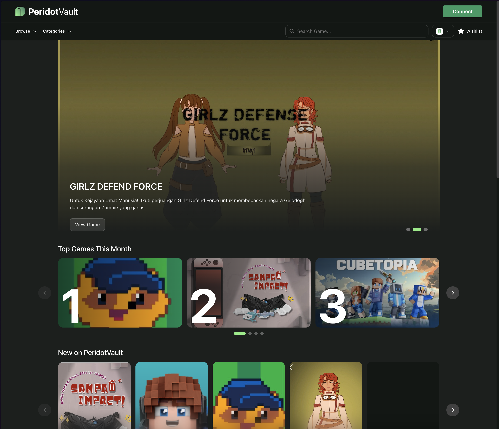

<p align="center">
  
</p>

<p align="center">
  <strong>Game Distribution Platform</strong>
</p>

<p align="center">
  <a href="https://github.com/peridotvault/app-peridotvault-web/blob/main/LICENSE"></a>
  <a href="https://nextjs.org"></a>
  <a href="https://react.dev"></a>
  <a href="https://www.typescriptlang.org"></a>
</p>

---

## Related Repositories

| Repo | Visibility | Link |
|---|---|---|
| Smart Contracts | Public | [peridotvault-contracts](https://github.com/peridotvault/peridotvault-contracts) |
| API Backend | Private | [peridotvault-api](https://github.com/peridotvault/peridotvault-api) |
| Faucet | Public | [peridotvault-faucet](https://github.com/peridotvault/peridotvault-faucet) |
| Landing Page | Public | [peridotvault](https://github.com/peridotvault/peridotvault) |

---

## Description

PeridotVault is a gaming launcher where players can get paid for helping games grow. Discover a game, play it, share it, and earn money when your link drives a sale. Developers get a new distribution channel powered by real players, while streamers and creators can turn their audience into direct game revenue.

## What are you building, and Who is it for?

We are building a distribution platform for games, starting with indie developers and community-driven games. The product includes a web storefront, a studio dashboard for publishers, a player-facing marketplace, referral tracking, on-chain license ownership, and payment/revenue-splitting infrastructure.

The platform is for three main users:

1. **Game developers** who need better distribution and lower-cost growth.
2. **Players** who want to discover games and earn by sharing games they love.
3. **Creators and streamers** who want a direct economic reason to promote new games.

The core idea is simple: **every player can become a growth channel.**

## Why decide to build this, and why build it now?

**We decided to build PeridotVault because players already help games make money, but they rarely get paid for it.**

A player can recommend a game to a friend, a streamer can drive hundreds of people to buy a game, and a community can make a small title go viral. But most of that value goes unrewarded. At the same time, many developers struggle to reach players because ads are expensive, storefronts are crowded, and discovery depends too much on algorithms.

**PeridotVault fixes this by rewarding the people who actually help games grow.** When someone helps a game sell, they can earn from it. This creates a better system for everyone: players get paid for real impact, streamers get a new revenue stream, and developers get distribution powered by people who actually care about their games.

### Key Features

- **Game Discovery** — Featured banners, top games, new releases, category browser, and full-text search
- **Multi-Chain Purchases** — Buy game licenses on EVM (Base, Lisk) or Solana with on-chain verification
- **Wallet Authentication** — Sign-in with Ethereum/Solana wallets via challenge-response (SIWE-like)
- **User Library** — View owned games fetched from both API and on-chain data
- **Wishlist** — Save games for later with real-time status indicators
- **Payment Token Selection** — Choose from supported payment tokens (native, ERC-20, SPL) at checkout
- **Responsive Design** — Fully responsive UI from desktop to mobile breakpoints
- **Embed Mode** — Detect and adapt when running inside an iframe

---

## Screenshot

<p align="center">
  
</p>

---

## Technologies

Solana, Anchor, Rust, TypeScript, Next.js, React, Tailwind CSS, Node.js, PostgreSQL, Docker, SPL Token, Vercel

## Tech Stack Details

| Layer               | Technology                   |
| ------------------- | ---------------------------- |
| **Framework**       | Next.js 16 (App Router)      |
| **Language**        | TypeScript 5.9 (strict mode) |
| **UI**              | React 19, Tailwind CSS 4     |
| **Animation**       | Framer Motion, GSAP          |
| **State**           | Zustand 5                    |
| **Client DB**       | Dexie (IndexedDB)            |
| **HTTP**            | Axios                        |
| **EVM**             | Viem 2 (Base, Lisk)          |
| **Solana**          | `@solana/web3.js` 1.98       |
| **Icons**           | FontAwesome 7                |
| **Toasts**          | Sonner                       |
| **Package Manager** | pnpm                         |
| **Deployment**      | Docker (standalone output)   |

---

## Project Architecture

```
src/
├── app/                          # Next.js App Router pages
│   ├── _seo/                     # SEO metadata (OG, Twitter, canonical)
│   ├── (vault)/                  # Main route group
│   │   ├── page.tsx              # Home / Discovery
│   │   ├── game/[name]/[id]/     # Game detail + purchase modal
│   │   ├── my-games/             # User library (owned games)
│   │   ├── wishlist/             # User wishlist
│   │   └── my-profile/           # Profile page
│   └── user/                     # User settings
├── features/                     # Domain logic per feature
│   ├── auth/                     # Wallet auth (verify, refresh, logout)
│   ├── game/                     # Catalog, purchase flow, game cards
│   ├── library/                  # Owned games (API + on-chain)
│   ├── wishlist/                 # Wishlist CRUD
│   ├── chain/                    # Chain data with IndexedDB cache
│   ├── setting/                  # Network & chain selection
│   ├── event/                    # Analytics events
│   └── security/                 # Embed mode, wallet injection
├── core/                         # Infrastructure layer
│   ├── blockchain/               # EVM (viem) + SVM (Solana) services
│   ├── api/                      # REST clients (games, purchases, etc.)
│   ├── db/                       # Dexie tables & repositories
│   └── ui-system/                # Modal stack, toast service
└── shared/                       # Reusable primitives
    ├── components/ui/            # Atoms, molecules, organisms
    ├── hooks/                    # Shared React hooks
    ├── states/                   # Zustand stores
    ├── utils/                    # Pure utility functions
    ├── lib/                      # HTTP client (axios interceptor)
    ├── constants/                # Chain configs, defaults, TTLs
    ├── types/                    # Shared TypeScript types
    └── styles/                   # Global CSS, design tokens
```

### Key Architectural Patterns

1. **Hybrid On-Chain/Off-Chain** — Game metadata from REST API; license ownership and purchases verified on-chain
2. **Chain Resolver Pattern** — Single `chain.service.ts` dispatches to EVM or SVM service based on chain key
3. **Proactive JWT Refresh** — Axios interceptor schedules token refresh 5 minutes before expiry with single-flight deduplication
4. **Offline-First Caching** — Chain data, auth sessions, and settings cached in IndexedDB with TTL invalidation
5. **Modal Stack** — Zustand-based modal system supporting arbitrary React content (purchase flow, share, login)
6. **Vendored Wallet Adapters** — `@antigane/wallet-adapters` pinned as local `.tgz` for custom wallet integration

---

## Getting Started

### Prerequisites

- **Node.js** 22+
- **pnpm** (follows `pnpm-lock.yaml`)

### Install Dependencies

```bash
pnpm install
```

### Environment Variables

Copy the example and fill in the required values:

```bash
cp .env.example .env.local
```

| Variable                   | Description                       |
| -------------------------- | --------------------------------- |
| `NEXT_PUBLIC_API_BASE_URL` | Base URL for the PeridotVault API |
| `NEXT_RPC_URL`             | Default RPC endpoint              |
| `NEXT_REGISTRY`            | Registry contract address         |

Additional chain-specific contract addresses are configured in `.env.local` for Base, Lisk, and Solana (both mainnet and testnet).

### Development

```bash
pnpm dev
```

Open [http://localhost:3000](http://localhost:3000) in your browser.

### Build

```bash
pnpm build
```

### Lint

```bash
pnpm lint
```

---

## Docker

A multi-stage Dockerfile and docker-compose files are provided for containerized builds and local development.

```bash
# Build the image
docker build -t peridotvault-web .

# Run with docker compose
docker compose up
```

The Docker setup uses Node 22 Alpine, standalone Next.js output, and runs as a non-root `nextjs` user on port 3000.

---

## Supported Chains

| Chain  | Network                     | VM  |
| ------ | --------------------------- | --- |
| Base   | Mainnet / Testnet (Sepolia) | EVM |
| Lisk   | Mainnet / Testnet (Sepolia) | EVM |
| Solana | Mainnet / Devnet            | SVM |

---

## License

Proprietary — all rights reserved by PeridotVault.
